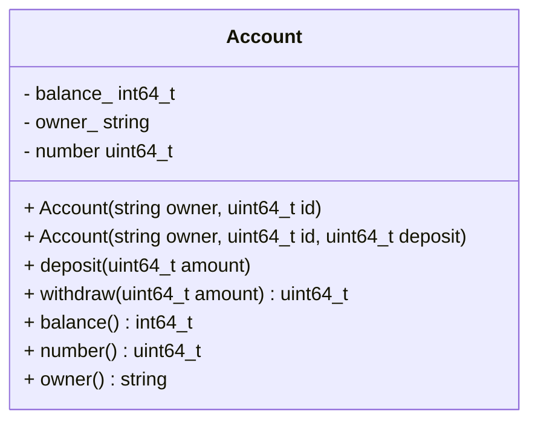

[](README.md)
[](README.de-at.md)


# Einführung in die Objektorientierte Programmierung - Bankkonto

Nach Abschluss der Aufgaben können die folgenden Befehle ausgeführt werden,
um die Richtigkeit der Lösung zu prüfen.

```shell
mkdir build && cd build
cmake ..
make -j4
make test
```

Alternativ zu `make test` können die einzelnen `*_test` Programme ausgeführt
werden.


```
mkdir build && cd build
cmake ..
make -j4
./account_test
```

## Problembeschreibung

Erstellen Sie eine Klasse namens `Account` zur Verwaltung von
Bankkontoinformationen. Die Klasse muss in der Datei `account.hpp` definiert
werden. Alle nichttrivialen Methoden müssen in `account.cpp` definiert werden.
Es ist der Namespace `bank` zu verwenden.

Es ist eine Datei `main.cpp` mit einer Funktion `main(.)` zu erstellen.
Darin ist die `Account` Klasse wie folgt zu verwenden:

* Erstellen Sie mindestens zwei verschiedene Konten.
* Führen Sie mehrere Ein- und Auszahlungen durch.
* Zeigen Sie den Endsaldo an.

Das Bankkonto muss die Spezifikation im unten stehenden Klassendiagramm
erfüllen.



Die ersten drei Zeilen im Diagramm sind Datenmember. Das Minus davor deutet
an, dass es sich um private Member handelt. Die übrigen Einträge sind
Methoden, wobei das Plus den öffentlichen Zugriff anzeigt. Die Beträge werden
als Ganzzahlen gespeichert, um Probleme mit der Gleitkomma-Genauigkeit zu
vermeiden. Der in `balance_` gespeicherte Betrag repräsentiert Cents. Ein Saldo
von 172042 entspricht somit 1720 Euro und 42 Cent. Es ist zu beachten, dass die
Methode `withdraw(.)` den tatsächlich abgehobenen Betrag auch zurückgibt.

Abschliessend ist der `operator<<` zu überladen, um Kontodaten (Kontonummer
und aktuellen Saldo in Euro und Cent) auszugeben.
