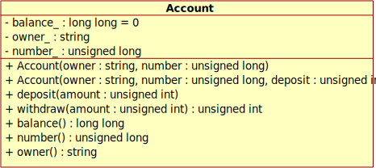

# Introduction to OOP

After finishing the below tasks, run the following commands to see if your
code is correct.

```
mkdir build && cd build
cmake ..
make -j4
./account_test
```

## Bank Account
Create an `Account` class for managing bank account information. The class must
be defined in `account.hpp` and the non-trivial methods in `account.cpp`.
Everything must be part of a `bank` namespace.
Use your `Account` in this mini-project's `main.cpp` file:

* create at least two different accounts
* perform multiple deposits and withdrawals
* display the final balance

Provide a `Makefile` that compiles the project. The generated executable must
be called `bank`.

The bank account must follow the specification in the class diagram below.

 

The first three lines in the diagram are data members. The minus in front
of them indicates that they are private members. The remaining entries are
methods with the plus indicating public access.
The amounts are stored as integral numbers to avoid problems with floating
point precision. The amount stored in the balance represents cents.
A balance of 172042 corresponds hence to 1720 Euros and 42 Cents.
Note that the `withdraw(.)` method returns the amount actually withdrawn
which will help us when subclassing the Account in the future.
Override the `operator<<` to print account data (account number and current
balance in Euro and Cent).
